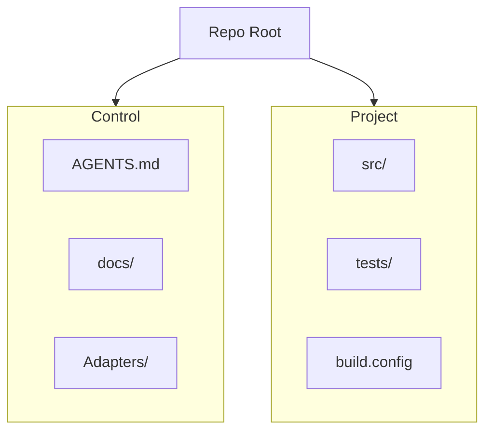

# Project Initialization Guide

Use this guide to start a new, stack-agnostic project within this OrchLayer skeleton.

## Quick Start

1. **Choose your stack**: (e.g., Python, Node.js, Rust).
2. **Initialize in `/src`**: Create the `/src` directory for your implementation.
3. **Keep it Clean**: Do not add `.md` instructions or AI-specific files inside `/src`.
4. **Update the Board**: Update `docs/PROGRESS-BOARD.md` to reflect your new project goals.

## Why Agnostic?

By keeping your implementation in `/src` separate from the `docs/` and `00_Project-Core/` folders, you ensure:

- **Portability**: Your code can be moved to a repository without OrchLayer at any time.
- **Clarity**: AI agents won't confuse business logic with orchestration rules.
- **Token Efficiency**: Agents only need to read the "Control Plane" once to understand how to manage the "Project Code".

## Visualization of Separation

