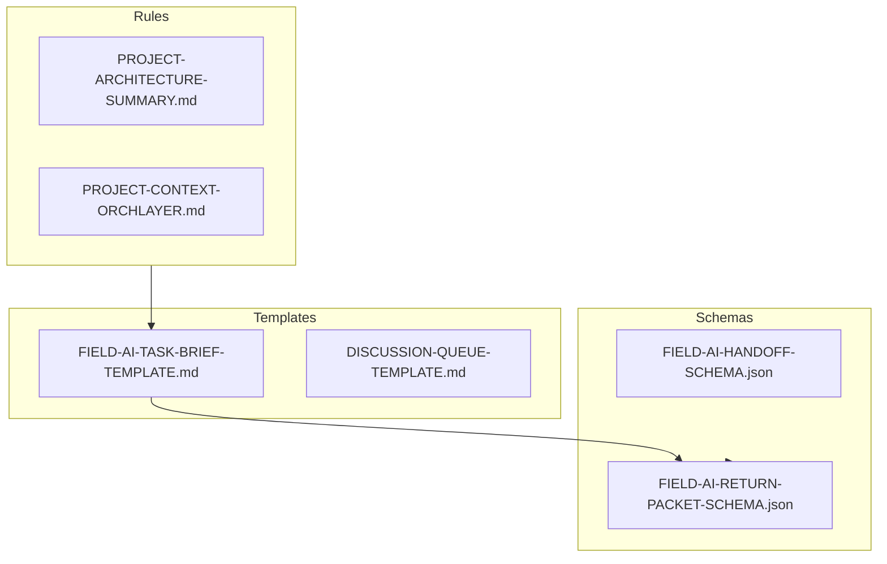

# 00_Project-Core

## Purpose

This directory contains the essential DNA of the OrchLayer project. It defines the schemas and templates that govern how human and AI agents collaborate.

## Visualized Logic

## Folder Role

Classified as: **stable reference**

- **FIELD-AI-PLATFORM-INITIALIZATION-MATRIX.md**: The master routing log for choosing the right adapter.
- **FIELD-AI-ENV-INIT.md**: The standard "Hello World" for any newly initialized field AI.
- **PROJECT-SPECIFIC-TASK-STARTERS.md**: Curated prompts for common project activities.
