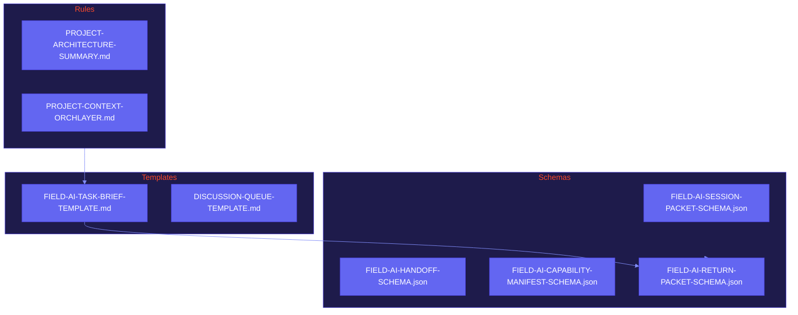

# 00_Project-Core

## Purpose

This directory contains the essential DNA of the OrchLayer project. It defines the schemas and templates that govern how human and AI agents collaborate.

## Visualized Logic

## Core Contracts (FIELD-AI)

- **Source of Truth**: The JSON schemas in this directory are the canonical definitions for all continuity artifacts. All adapters must conform to these.
- **Immutability Rule**: Mutable working state (e.g., specific session notes) does not belong here; use `01_Project-State/` or `02_Session-Packets/`.
- **Verification**: Capability declarations are environment-specific templates. A capability is only "active" if verified and documented in `01_Project-State/CAPABILITY-MANIFEST.current.json`.
- **Legacy Support**: Older packets missing the `session_frame` must be wrapped into the new structure rather than modified in place.

## Folder Role

Classified as: **stable reference**

- **FIELD-AI-PLATFORM-INITIALIZATION-MATRIX.md**: The master routing log for choosing the right adapter.
- **FIELD-AI-ENV-INIT.md**: The standard "Hello World" for any newly initialized field AI.
- **PROJECT-SPECIFIC-TASK-STARTERS.md**: Curated prompts for common project activities.
