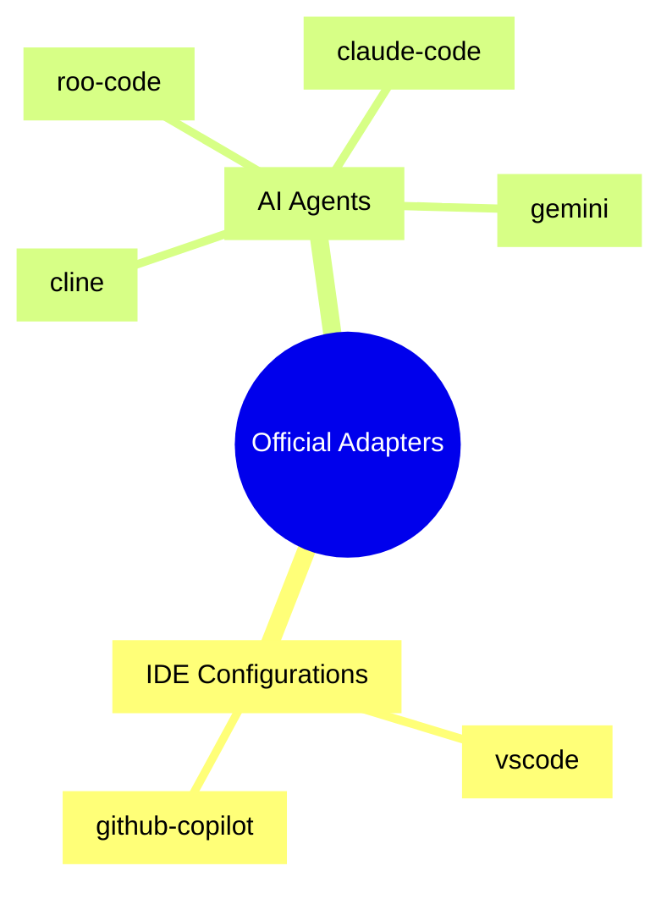

# 10_Officially-Documented-Adapters

## Purpose

Contains platform-specific configuration and instruction files for AI coding environments with officially supported plugin or rule systems.

## Visualized Adapters

## Selection Guide

Classified as: **stable reference / handoff**

Use these when the platform explicitly supports a `.clinerules`, `.cursorrules`, or similar dedicated instruction file mechanism. These adapters are designed to be the "minimum viable wrapper" around the universal `AGENTS.md` and `00_Project-Core` rules.
