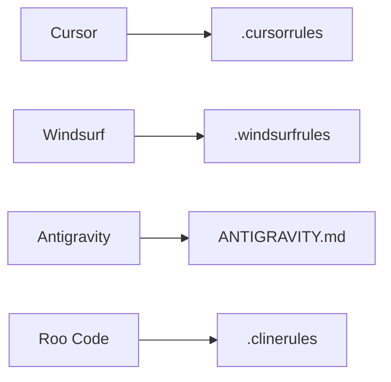

# 20_Convention-Based-Adapters

## Purpose

Focuses on AI environments that rely on file-name conventions or root-level instructions rather than a formal API or plugin system.

## Comparison Map

## Strategy

Classified as: **implementation / overlay**

These files often "mirror" the root `AGENTS.md` but are tailored to the specific quirks and context windows of each tool. They ensure that even if the tool doesn't have a formal plugin, it still adheres to the OrchLayer L1 contract.
