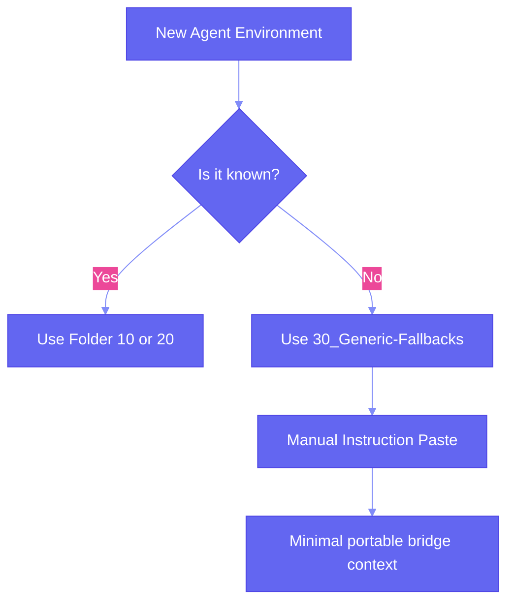

# 30_Generic-Fallbacks

## Purpose

The ultimate fallback for any environment that is unknown, stateless, or doesn't support persistent instruction files.

## Fallback Logic

## Contents

Classified as: **archive / stable reference**

- **FIELD-AI-INITIALIZATION-PROMPT.md**: A compact, copy-pasteable version of the core project rules.
- **FIELD-AI-HANDOFF-TEMPLATE.json**: Simplified handoff structure for quick sessions.
