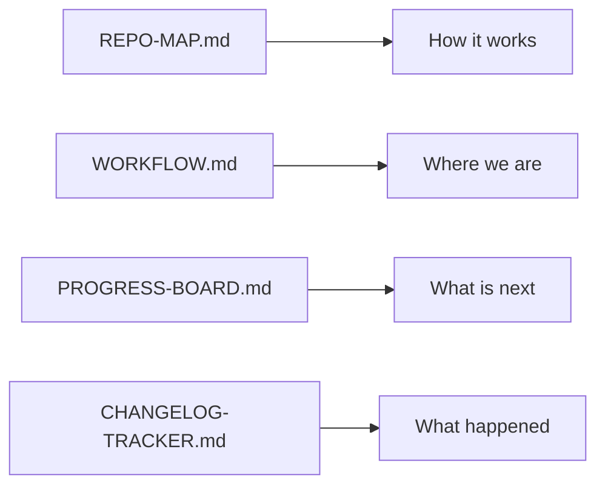

# Repository Documentation

## Purpose

This directory hosts the "Project Pulse" — the living files that track workflow, architecture changes, and progress in a way that is easily consumable by both humans and AI.

## Tracking Synergy

## Key Files

Classified as: **project state / audit**

- **REPO-MAP.md**: Detailed breakdown of every folder's purpose.
- **WORKFLOW.md**: The Mermaid map of the core collaboration loop.
- **PROGRESS-BOARD.md**: High-level status and ownership.
- **CHANGELOG-TRACKER.md**: Structured log of every meaningful repo change.
