# Workflow

## Current Generic Workflow

```mermaid
%%{init: {
  'theme': 'base',
  'themeVariables': {
    'primaryColor': '#6366f1',
    'primaryTextColor': '#fff',
    'primaryBorderColor': '#4f46e5',
    'lineColor': '#818cf8',
    'secondaryColor': '#ec4899',
    'tertiaryColor': '#06b6d4'
  }
}}%%
flowchart LR
  A[User / Orchestrator Input] --> B[Repo Inspection]
  B --> C[Task Planning]
  C --> D[Implementation / Editing]
  D --> E[Validation]
  E --> F[Change Summary]
  F --> G[Git Management / Commit]
  G --> H[Next Task / Handoff]
```

## Tracking Rules

For every major change, update:

* current phase
* top problems
* top solutions
* next task
* affected folders

## Minimal Progress Format

* Phase:
* Active Task:
* Changed Areas:
* Verification:
* Blockers:
* Next Step:
